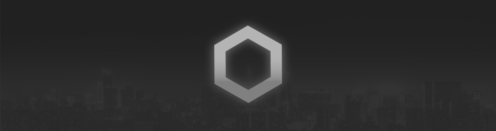

# SynthDark - VS Code theme



Highly based on Robb Owen theme what you can find here: [GitHub repo](https://github.com/robb0wen/synthwave-vscode).


## But...why?
The original theme description told us "is not intended to be a long sesion use theme" then , why not?

The glow may be annoying after some time in the editor but, if we use another color palette, darker and eye friendly we can use it dialy!

And thats what i expect from this theme.

Much the same way, in the modern web-development world of shaders, React and WebGL, I feel like it's easy to forget that the basics are actually pretty damn good. To that end, this theme goes back to basics - No Shader magic. No cloud-streamed WebGL render-farms. Just plain CSS :)


## Installation
Use Node to install Visual Studio Code extension tool
```
npm i -D vsce
```

Then run the 'compiler' on the theme path
```
vsce package
```

This will create a .vsix file, finally install it using 

```
code --install-extension {filename.vsix}
```

### Disclaimer
VS code doesn't natively support text effects and as a result, the glow is experimental. It's likely to be buggy and, whilst it looks rad, it isn't intended for extended use. To enable the glow, the extension has to modify the internal files of VS Code, so use with caution. Should something go wrong, you can disable the glow by following the instructions below. If for any reason you can't open VS Code, you can fix the issue with a fresh install of VS Code.

If you do decide use the glow effect, you do so at your own risk. Bring your Sunglasses. Here be (laser)dragons.

### To enable the glow
Firstly, if you are a Windows user, you may need to run VS Code with administrator privileges. For Linux and Mac users, Code must not be installed in a read-only location and you must have write permissions.

To activate the glow, Set your active colour theme to SyntDark - as of v0.1.0 the glow is only active when the base theme is selected. Open your command palette with `Ctrl + Shift + P` or `Shift + ⌘ + P` and choose "__Enable Neon Dreams__". It will prompt you to restart, and when you do the lights should be on :)

Note: In the name of simplifying the install process and mitigating update-related issues, the new version of SyntDark doesn't use a custom CSS file anymore. _If you have been using a custom-modified version of the theme, then you can still continue to use that with the previous Custom CSS and JS method_.

#### To customise the glow brightness
In your `settings.json` add the key:
```
"synthwave84.brightness": 0.2
```
The value should be a _float value_ from 0 to 1, where 0.0 is fully transparent. The default brightness is 0.45. To avoid eye strain, avoid using higher brightness values for extended periods of time. 

To see the changes, you need to rerun the activation function. Open your command palette with `Ctrl + Shift + P` or `Shift + ⌘ + P` and choose "__Enable Neon Dreams__".

Note: Changing the brightness currently only affects the opacity of the glow, the text will remain white (that may change in future updates). If you want to disable the glow effect but retain the chrome updates, see below.

### To remove corruption warning and [unsupported] from title-bar
Because enabling the glow modifies core files, VS code will interpret this as the core being 'corrupted' and you may see an error message on restarting your editor. You can safely dismiss this message, or remove it entirely with the [Fix VSCode Checksums](https://marketplace.visualstudio.com/items?itemName=lehni.vscode-fix-checksums 'Fix VSCode Checksums') extension.

Upon installation of 'Fix VSCode Checksums', open the command palette and execute `Fix Checksums: Apply`. You will need to completely restart VSCode after execution, reopening without fully exiting might not be enough.

## Updates
Every time you update VS code, you will need to repeat this step to re-enable the glow whit the command palette.

## Disabling the glow and uninstallation
The glow effect started as a joke and was never intended for long-term coding sessions. If you want to turn it off, you can disable it at any time by opening your command palette with `Ctrl + Shift + P` or `Shift + ⌘ + P` and choose "__Disable Neon Dreams__".

## Compatibility
This theme is still **very much a work in progress**. I primarily develop in HTML & CSS, JS and React so, whilst those language sets should look pretty good, there will likely be issues for other languages.

## Contributing
I'm really happy to consider any contributions to this theme. Before you make any changes, [please read the contribution guide](https://github.com/robb0wen/synthwave-vscode/blob/master/CONTRIBUTING.md).

## Thanks from original repo and me too!
Lastly, I couldn't have made this if it weren't for the fantastic work of [Sarah Drasner](https://twitter.com/sarah_edo). Her [tutorial on theming for CSS tricks](https://css-tricks.com/creating-a-vs-code-theme/) was a huge help in developing this 🙏

Similarly, I'd like to thanks [Wes Bos](https://twitter.com/wesbos) for his [cool Cobalt2 theme](https://github.com/wesbos/cobalt2-vscode). His readme helped me figure out how to package this hot mess for public use 👍

If this theme is too much, then I recommend [Horizon](https://github.com/jolaleye/horizon-theme-vscode), or [City Lights](http://citylights.xyz/) for a similar, yet more understated, retro vibe. They're both beautiful.

Banner cityscape image from [Unsplash](https://unsplash.com/photos/DxHR8K5Egjk)
